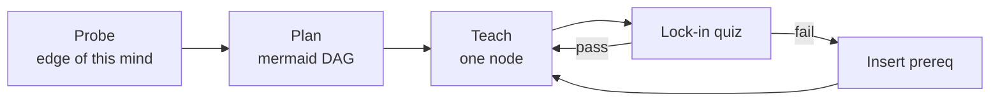

<p align="center">
  
</p>

<p align="center">
  <strong>One teacher. One mind.</strong><br/>
  Portable agent skills that run Eero Alvar’s AI learning loop.
</p>

<p align="center">
  <a href="https://github.com/vasanthsreeram/Alvarmethod/stargazers"></a>
  <a href="LICENSE"></a>
  <a href="https://agentskills.io"></a>
  <a href="https://youtu.be/kzcI5F4tGiU"></a>
</p>

```bash
npx skills add vasanthsreeram/Alvarmethod -g --all
```

That’s the install. Works in **Claude Code**, **Codex**, **Grok**, **Pi**, **OpenCode**, Cursor, and the rest of the [skills CLI](https://skills.sh) agents.

Then open a **learning folder** (not this repo) and say:

```text
/alvar-learn I want a solid introduction to <topic>
```

You should get a **quiz picker** (not A/B/C/D in chat; that is a CLI-harness rule, while in the Gemini Gem letters are the sanctioned protocol) → a mermaid DAG → **one** reasoning step → a lock-in quiz.

---

## Quick install

### `npx skills` (preferred)

The [open skills CLI](https://github.com/vercel-labs/skills). Discovers every `skills/*/SKILL.md` in this repo.

```bash
# global, every detected agent, no prompts
npx skills add vasanthsreeram/Alvarmethod -g --all

# list what’s in the pack
npx skills add vasanthsreeram/Alvarmethod --list

# one skill
npx skills add vasanthsreeram/Alvarmethod --skill alvar-learn -g -y

# one harness
npx skills add vasanthsreeram/Alvarmethod -g -y -a claude-code -a grok -a pi -a opencode -a codex
```

Update later:

```bash
npx skills update -g
```

### `npx` this repo

No extra CLI — runs [`install.sh`](install.sh) from GitHub:

```bash
npx github:vasanthsreeram/Alvarmethod
npx github:vasanthsreeram/Alvarmethod --list
npx github:vasanthsreeram/Alvarmethod --claude --grok
```

### Clone

```bash
git clone https://github.com/vasanthsreeram/Alvarmethod.git
cd Alvarmethod
./install.sh          # all known agent dirs
./install.sh --project
./install.sh --uninstall
```

| Agent | Global path |
|-------|-------------|
| Codex | `~/.codex/skills` + `~/.agents/skills` |
| Claude Code | `~/.claude/skills` |
| Grok | `~/.grok/skills` |
| Pi | `~/.pi/agent/skills` |
| OpenCode | `~/.config/opencode/skills` |

---

## The method

Credit: **[Eero Alvar — *How I Use AI to Learn Things*](https://youtu.be/kzcI5F4tGiU)** (2026-08-14). This pack implements that loop as Agent Skills. It is not his original Pi quiz / Obsidian setup. Captions: [`source/eero-alvar-how-i-use-ai-to-learn-things.md`](source/eero-alvar-how-i-use-ai-to-learn-things.md).

Many-to-many learning leaks:

| Direction | Waste |
|-----------|--------|
| One outlet → many students | Never fitted to *your* edge |
| One student → many outlets | Switching cost + the brain hedges on sources it does not trust |

Fix: **one interface, many sources.** Trust is engineered (verify). Struggle stays in the material. The system eats logistics.



1. **Probe** — graded MCQ in the harness picker, start wide, binary-search every strand
2. **Plan** — mermaid DAG for *this* mind, shown *before* teaching
3. **Teach** — one reasoning step, picture if needed, quiz, next node

---

## Skills

| Skill | Job |
|-------|-----|
| `alvar-learn` | Full loop: probe → plan → one-step teaching |
| `probe` | Understanding map only |
| `learn-profile` | Write `.alvar/LEARNER.md` |
| `learn-visual` | One SVG, look at it, fix it |
| `learn-verify` | Fact-check a claim before it is taught as fact |

Quizzes **must** use the native picker (CLI harnesses; the Gemini Gem’s letter protocol is the sanctioned exception):

| Agent | Tool |
|-------|------|
| Grok / Codex | `ask_user_question` |
| Claude Code | `AskUserQuestion` |
| OpenCode | `question` |
| Pi | `quiz` / `ask_user` / `askUserQuestion` |

If the agent pastes A/B/C/D, say **“use the quiz tool.”** (A CLI-harness rule; in the Gemini Gem, letters are the protocol.) If it dumps a textbook, say **“one node only.”**

Session files land in the learning folder:

```text
.alvar/LEARNER.md
.alvar/maps/<topic>.md
.alvar/sessions/<date>-<topic>.md
.alvar/visuals/…
```

Point Obsidian at `.alvar/` if you want LaTeX preview.

## Gemini web (Gem)

The same loop as a shareable [Gem](https://gemini.google.com), built from `gems/alvar-tutor/`: create-and-install steps live in [`gems/alvar-tutor/README.md`](gems/alvar-tutor/README.md). No skills runtime there, and no question tool either, so letters (A/B/C plus “D. I don’t know”, one question per message) stand in for the picker.

---

## Contributing

See [CONTRIBUTING.md](CONTRIBUTING.md). Edit skills **here**, then reinstall. Don’t patch the copies under `~/.claude` / `~/.grok`.

## License

MIT for the skills, installer, and docs.

The video and spoken method are **Eero Alvar’s**. Watch the original: [youtu.be/kzcI5F4tGiU](https://youtu.be/kzcI5F4tGiU).
